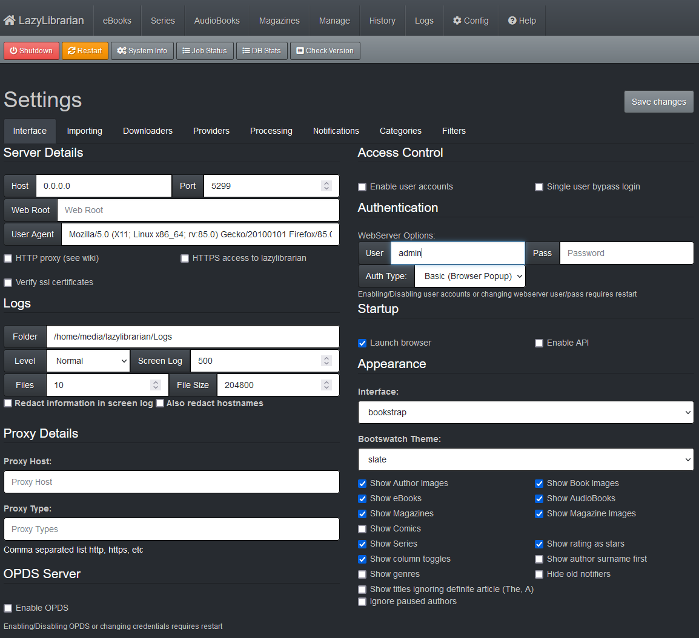
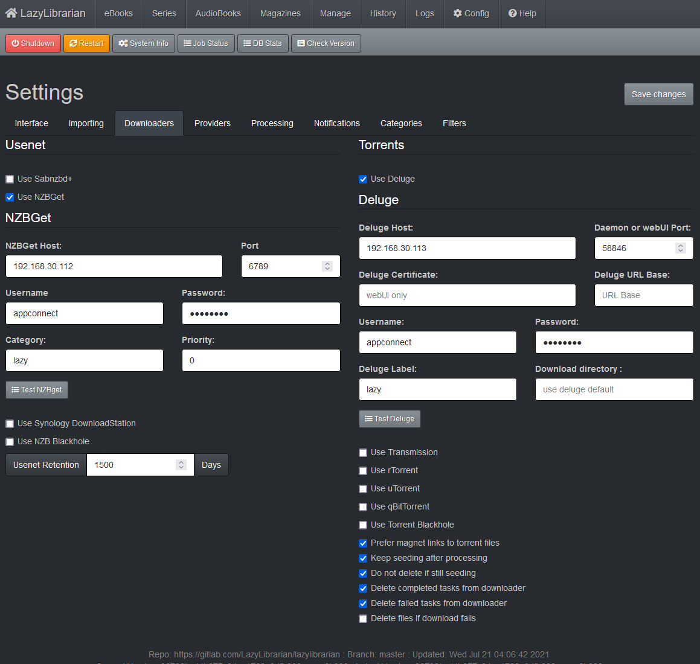
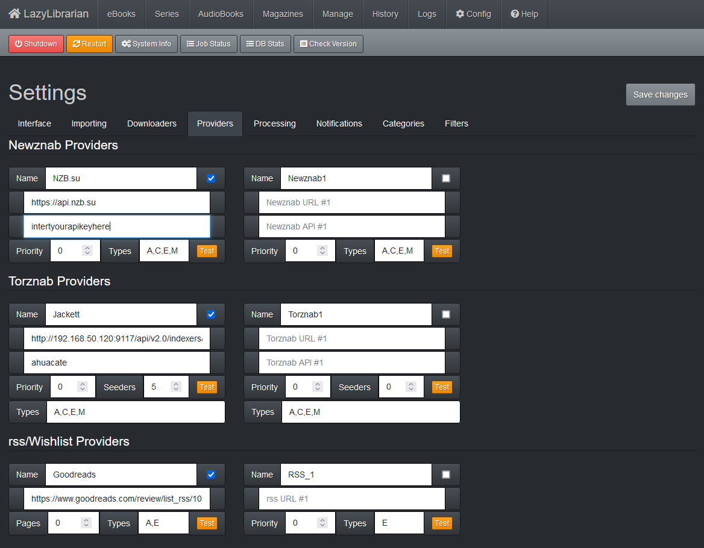
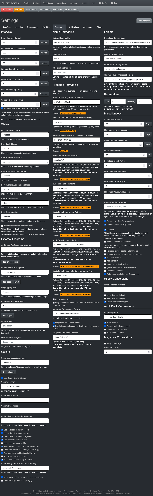
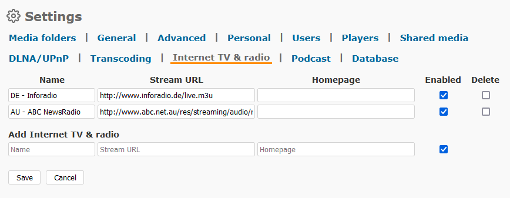
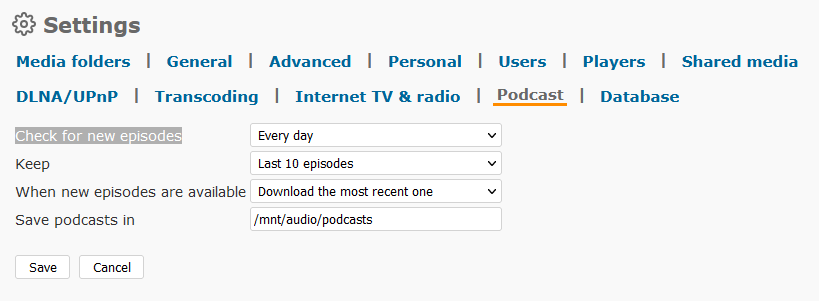

<h1>Ahuabooks Suite</h1>
Ahuabooks is a suite of software for managing your ebook, audiobook, podcast, and magazine requirements.

The software suite includes:
*  Lazylibrarian
*  Calibre
*  Calibre-web ( frontend for Calibre )
*  Booksonic
*  Podgrab

**Prerequisites**

Network prerequisites are:
- [x] Layer 2 Network Switches
- [x] Network Gateway is `192.168.1.5`
- [x] Network DNS server is `192.168.1.5` (Note: your Gateway hardware should enable you to configure DNS server(s), like a UniFi USG Gateway, so set the following: primary DNS `192.168.1.6` which will be your PiHole server IP address; and, secondary DNS `1.1.1.1` which is a backup Cloudflare DNS server in the event your PiHole server 192.168.1.6 fails or is down)
- [x] Network DHCP server is `192.168.1.5`

Other Prerequisites are:
- [x] Proxmox node as per [configuration](https://github.com/ahuacate/pve-host) (Recommended).
- [x] PVE Host Backend Storage mounted to your NAS
	- nas-0X-audio
	- nas-0X-backup
	- nas-0X-books
	- nas-0X-downloads
	- nas-0X-public
	You must have a running Network Attached File Server (NAS) with ALL of the above NFS and/or CIFS backend share points configured on your PVE host pve-01.
- [x] PVE Deluge LXC as per [configuration](https://github.com/ahuacate/pve-medialab).
- [x] PVE Jackett LXC as per [configuration](https://github.com/ahuacate/pve-medialab).

Optional Prerequisites:
- [ ] pfSense configured with OpenVPN Gateways VPNGATE-LOCAL and VPNGATE-WORLD.
- [ ] PVE NZBGet LXC as per [configuration](https://github.com/ahuacate/pve-medialab) (Recommended).

Our Easy Scripts assumes your network is VLAN ready. If not, decline the Easy Script prompt to accept our default settings (Proceed with our Easy Script defaults (recommended) [y/n]?). You can then set your own PVE container variables.

<h4>List of Easy Scripts</h4>
<h7>Ahuabooks Installer</h7>
```
bash -c "$(wget -qLO - https://raw.githubusercontent.com/ahuacate/pve-medialab/main/pve_medialab_ct_ahuabooks_installer.sh)"
```

<hr>

<h4>Table of Contents</h4>

You need to configure all Ahuabooks suite of applications. There are dependencies between applications.

# Setup Calibre-Web
In your web browser type `http://192.168.50.118:8083` and click `Admin` to make configuration changes to Calibre.

## Edit Calibre Database Configuration
Click on `Edit Calibre Database Configuration`. 

| Options | Value
| :---  | :--- 
| Location of Calibre Database | `/mnt/books/ebooks`

## Edit Basic Configuration
Click on `Edit Basic Configuration`. 

### Server Configuration

| Options | Value
| :---  | :--- 
| Server Port | `8083`
| SSL certfile location | blank
| SSL Keyfile location | blank
| Update Channel | `stable`

### Logfile Configuration

| Options | Value
| :---  | :--- 
| Log Level | `INFO`
| Location and name of logfile | `/home/media/calibre-web/logs/calibre-web.log`
| `☑` | Enable Access Log
| Location and name of access logfile | `/home/media/calibre-web/logs/access.log`

### Feature Configuration

| Options | Value
| :---  | :--- 
| ☐ | Enable Uploads
| ☐ | Enable Anonymous Browsing
| ☐ | Enable Public Registration
| ☐ | Enable Magic Link Remote Login
| ☐ | Allow Reverse Proxy Authentication 

### External binaries

| Options | Value
| :---  | :--- 
| Path to Calibre E-Book Converter | `/opt/calibre/ebook-convert`
| Calibre E-Book Converter Settings | blank
| Path to Kepubify E-Book Converter | blank

It's easy to get lost and forget what you've done, so save often.

---

# Setup LazyLibrarian
In your web browser type `http://192.168.50.118:5289` and click `Config`. Between each tab and sub-tab hit save. It's easy to get lost and forget what you've done, so save often.

## Interface settings
Click on the `Interface Tab`.

### Logs
Enter the logs folder:

| Logs | Value
| :---  | :--- 
| Folder | `/home/media/lazylibrarian/Logs`

### Authentication
Enter your Username and Password details as follows:

| WebServer Options | Value
| :---  | :--- 
| User | `admin`
| Pass | `add your chosen password`




## Import settings
Click on the `Importing Tab`.

### Information Sources
At the time of writing, LazyLibrarian supported GoodReads, GoogleBooks and Openlibrary. This tab is used to import your saved books from either GoodReads, GoogleBooks or Openlibrary. Setup instructions are [here](https://lazylibrarian.gitlab.io/config_importing/).

Best set to OpenLibrary.

| Option | Value
| :---  | :--- 
| Book Information | `OpenLibrary`
| GoogleBooks API | optional
| GoogleBooks Country | optional
| LibraryThing Developer Key | optional

### File formats
"epub, mobi, pdf" formats are good for ebooks so leave as default. Enable the two blacklist checkboxes.

| Option | Value
| :---  | :--- 
| eBooks | `epub, mobi, pdf`
| AudioBooks | `mp3, m4a`
| Magazines | `pdf`
|| `☑` Blacklist failed downloads in history table
|| `☑` Blacklist processed downloads in history table

### Language
I use "en, eng, en-US, en-GB, Unknown". You may not want Unknown unless you are having trouble getting books that should be available in your selected languages.

| Option | Value
| :---  | :--- 
| Import languages | `en, eng, en-US, en-GB`
| Languages for month names | blank

### Date formats
The date display options are personal preference. "\$m-\$d-\$Y" would be typical American date nomenclature. "\$Y-\$m-\$d" or "\$d-\$m-\$Y" for Europeans.

| Option | Value
| :---  | :--- 
| Added Dates | `$d-$m-$Y`
| Issue Dates | `$Y-$m-$d`


Remember to click `Save changes`.

## Downloader settings
Click on the `Downloaders Tab`.

You will need your NZBGet `RestrictedUsername` and the `RestrictedPassword` you configured in NZBGet settings. If you applied our Easy Script application settings the Username `appconnect` and password `ahuacate` are preset.

### Usenet
You must have PVE NZBGet LXC configured and running at http://192.168.30.112:6789/ (or whatever IPv4 you configured).

Set the values as follows, remembering to click `Save changes` when finished:

| Usenet| Value
| :---  | :--- 
| ☐ | Use Sabnzbd+
| `☑` | Use NZBGet
| **NZBGET**
| NZBGet Host | `192.168.30.112` (Or whatever IPv4 you set)
| Port | `6789`
| Username | `appconnect`
| Password | `ahuacate` (Type your NZBGet RestrictedPassword)
| Category | `lazy`
| Priority | `0`
| ☐ | Use Synology DownloadStation
| ☐ | Use NZB Blackhole
| Usenet Retention | `1500` Days

### Torrents
You must have PVE Deluge LXC configured and running at http://192.168.30.113:8112/ (or whatever IPv4 you configured).

Set the values as follows, remembering to click `Save changes` when finished:

| Torrent| Value
| :---  | :--- 
| `☑` | Use Deluge
| **Deluge**
| Deluge Host | `192.168.30.113`
| Daemon or webUI Port | `58846`
| Deluge Certificate | Leave blank
| Deluge URL Base | Leave blank
| Username | `appconnect`
| Password | `ahuacate`
| Deluge Label | `lazy`
| Download directory | Leave blank
| ☐ | Use Transmission
| ☐ | Use rTorrent
| ☐ | Use uTorrent
| ☐ | Use qBitTorrent
| ☐ | Use Torrent Blackhole
| `☑` | Prefer magnet links to torrent files
| `☑` | Keep seeding after processing
| `☑` | Do not delete if still seeding
| `☑` | Delete completed tasks from downloader
| `☑` | Delete failed tasks from downloader
| `☑` | Delete files if download fails

Remember to click `Save changes`.



## Providers settings
Click on the `Providers Tab`.

### Newznab Providers
You need a Usenet service provider account who will provide you with a URL and API credentials.

The following example is for NZB.SU usenet provider.

| Newznab | Value
| :---  | :--- 
| Name | `NZB.su`
| `☑` | Enabled
| Newznab URL | `https://api.nzb.su`
| Newznab API | Insert your API key
| Priority | 0
| Types | A,C,E,M

### Torznab Provider
Here we connect with your PVE Jackett LXC for torrent searches.

| Torznab | Value
| :---  | :--- 
| Name | `Jackett`
| `☑` | Enabled
| Torznab URL | `http://192.168.50.120:9117/api/v2.0/indexers/all/results/torznab` (Note your PVE Jackett LXC IPv4)
| Torznab API | `ahuacate` (Preset by settings Easy Script)
| Priority | 0
| Seeders | 0
| Types | A,C,E,M

### rss/Wishlist Providers
You can use RSS/Wishlist feed as sources for wanted book lists. If the RSS feed is from GoodReads, Amazon, New York Times, or Listopia, it will grab that list of books, begin searching, and then download them. 

I use this with GoodReads. Find or create a bookshelf on GoodReads. Populate that shelf. Then click on the shelf to show the list. At the bottom of the page, there is a small link labeled 'RSS'. Copy that link. Paste that link into the RSS URL field in LazyLibrarian. Now, shortly after you add an item to this list in GoodReads, LazyLibrarian will notice and look for the book.

Goodreads has an App for Android ( not sure about Apple products ).

| rss/Wishlist Providers | Value
| :---  | :--- 
| Name | `Goodreads`
| `☑` | Enabled
| rss URL | `https://www.goodreads.com/review/list_rss/ANIDENTIFIER?key=AWHOLEBUNCHOFSTUFFTHATCOULDBEUSEDTOIDENTIFYYOU&shelf=to-read`
| Priority | 0
| Types | `A,E`

Note the `Types` section sets the media type to download ( A = Audiobooks, E = Ebooks ).

### Blocked Providers
At the bottom of the page is a button marked `Blocked Providers`. There probably are not any right now. As you use LazyLibrarian, if the software encounters issues with a provider, it uses the list here to throttle that connection. If you've fixed something that is paused/throttled/blocked, just come here, open the list, and turn it off. It automatically turns back on if needed.



## Processing settings
Click on the `Processing Tab`. Only input or make changes as shown. Complete the settings as follows.

### Intervals

| Option | Value
| :---  | :--- 
| `☑` | Auto Update when new version found

### Status
Nothing to do here.

### External Programs

| Option | Value
| :---  | :--- 
| ffmpeg output extension | `m4a`

### Calibre

| Option | Value
| :---  | :--- 
| Calibredb import program | `calibredb`
| `☑` | Use Calibre Content Server
| Calibre Server | `http://localhost:8080`
| `☑` | Use calibredb to import ebooks
| `☑` | Use calibredb to import comics
| `☑` | Use calibredb to import magazines
| `☑` | Use magazine title as author
| Calibre Magazines Auto Add Directory | `/mnt/books/magazines`
| `☑` | Keep a copy of the magazine in the local library

### Name Formatting
Nothing to do here.

### Filename Formatting

| Option | Value
| :---  | :--- 
| AudioBook Filename Pattern for single file | `$Author - $Title`

### Folders

| Option | Value
| :---  | :--- 
| Download Directories | `/mnt/downloads/usenet/complete/lazy,/mnt/downloads/torrent/complete/lazy`
| eBook Libary Folder | `/mnt/books/ebooks`
| Audiobook Libary Folder | `/mnt/audio/audiobooks`
| Alternate Import/Export Folder | `/mnt/public/autoadd/direct_import/lazylibrarian`

### Permissions
Nothing to do here.

### Miscellaneous
Nothing to do here.

### Ebook Conversions

| Option | Value
| :---  | :--- 
| eBook wanted formats | `epub`
| ☐ | Keep downloaded opf
| ☐ | Keep downloaded jpg
| `☑` | Delete unwanted filetypes

### AudioBook Conversions
The MP3 settings create a folder containing multiple mp3 files by chapter. The M4A settings (recommended) merge all audio chapter files into a single m4a audio file while retaining chapter markings. The M4A is also compatible with Google YT Music players.

| Value - MP3 | Value - M4A (Recommended) | Option
| :---  | :--- | :---
| `-vn -b:a 128k -f mp3` | `-vn -b:a 128k -f m4a` | ffmpeg options 
| `☑` | `☑` | Write audio tags
| ☐ | `☑` | Create single file audiobook
| ☐ | ☐ | Create zip of audio parts
| ☐ | ☐ | Keep separate parts 

### Magazine Conversions
Nothing to do here.



---

# Setup Booksonic
In your web browser type `http://192.168.50.118:4040/booksonic` and login. The installer's default username and password are `admin` and `admin`.

If you are going to access Booksonic remotely using HAProxy ( Recommended ) or Port Forwarding ( Not recommended ) then you should immediately change the default password. 

## Settings
Click `Settings` to make configuration changes to Booksonic.

### Media Folders
Click on `Media folders` tab. 

| Name | Folder | Enabled | Delete
| :---  | :--- | :--- | :---
| Audiobooks | `/mnt/audio/audiobooks` | `☑` | ☐
| Podcasts | `/mnt/audio/podcasts` | `☑` | ☐

| Option | Value
| :---  | :--- 
| Exclude pattern | blank
| `☑` | Ignore Symbolic Links
| Scan media folders | Set your scan time
| `☑` | Fast access mode


### General
Click on `General` tab. 


### Advanced
Click on `Advanced` tab.

These settings are optional. If you use LDAP service like FreeIPA apply your settings here.


### Personal
Nothing to do here.

### Users
Click on `Users` tab.

If you are going to access Booksonic remotely using HAProxy ( Recommended ) or Port Forwarding ( Not recommended ) then you should immediately change the default admin password.


| Option | Value
| :---  | :--- 
| Select user | `admin`
| `☑` | User allowed to change personal settings and own password
| `☑` | User allowed to play files
| `☑` | User allowed to play files in jukebox mode
| `☑` | User allowed to download files
| `☑` | User allowed to upload files
| `☑` | User allowed to share files with anyone
| `☑` | User allowed to change cover art and tags
| `☑` | User allowed to create and edit own comments and ratings
| `☑` | User allowed to administrate podcasts
| Allow access to these media folders
| `☑` Audiobooks | /mnt/audio/audiobooks
| `☑` Podcasts | /mnt/audio/podcasts
| Max bitrate | No limit
| `☑` Change password
| New password | type your new admin password
| Confirm password | type your new admin password
| Email | type in your email

Add your new clients (users). If you are using LDAP like FreeIPA you can skip this step for creating your new users.

| Option | Value
| :---  | :--- 
| Select user | -- New User --
| ☐ | Administrative user
| `☑` | User allowed to change personal settings and own password
| `☑` | User allowed to play files
| `☑` | User allowed to play files in jukebox mode
| `☑` | User allowed to download files
| ☐ | User allowed to upload files
| ☐ | User allowed to share files with anyone
| ☐ | User allowed to change cover art and tags
| ☐ | User allowed to create and edit own comments and ratings
| ☐ | User allowed to administrate podcasts
| Allow access to these media folders
| `☑` Audiobooks | /mnt/audio/audiobooks
| `☑` Podcasts | /mnt/audio/podcasts
| Max bitrate | `128 Kbps`
| Username | insert new username
| Email | type in user email
| Password | type your new user password
| Confirm password | type your new user password

### Players
Click on `Players` tab.

| Option | Value
| :---  | :--- 
| Select player | `Player 1 [admin]`
| `☑` Web player | Play music directly in the web browser.
| ☐ External player | Play music on your favorite players, such as VLC.
| ☐ External player with playlist | Same as above, but with the playlist managed by the player, rather than the Airsonic server. In this mode, skipping within songs is possible.
| ☐ Jukebox | Play music directly on the audio device of the Airsonic server. (Authorized users only).
| ☐ Java Jukebox | Jukebox player that uses the Java Sound API. (Authorized users only). 
| Player name | blank
| Max bitrate | `128 Kbps`
| `☑` | The player has a dynamic IP address
| `☑` | Control player automatically
| `☑` | Apply BOM signature in the generated M3U file
| `☑` | mp3 audio
| `☑` | flv/h264 video
| `☑` | mkv video
| `☑` | mp4/h264 video

### Shared media
Click on `Shared media` tab.

Nothing to do here.

### DLNA/UPnP
Click on `DLNA/UPnP` tab.

Enable if you want to broadcast to your home devices.

### Transcoding
Click on `Transcoding` tab.

Nothing to do here.

### Internet TV & radio
Click on `Internet TV & radio` tab.

Here you can radio streams. It's best to use URLs with m3u or pls extensions in my experience. To search for radio URLs try this website [radio-browser](https://www.radio-browser.info/#/).

In this example we set up some news channels.

| Name | Stream URL | Homepage | Enabled | Delete
| :---  | :--- | :--- | :--- | :---
| `DE - Inforadio` | `http://www.inforadio.de/live.m3u` | not required | `☑` | ☐
| `AU - ABC NewsRadio` | `http://www.abc.net.au/res/streaming/audio/mp3/news_radio.pls` | not required | `☑` | ☐



### Podcast
Click on `Podcast` tab.

| Option | Value
| :---  | :--- 
| Check for new episodes | `Every day`
| Keep | `Last 10 episodes`
| When new episodes are available | `Download the most recent one`
| Save podcasts in | `/mnt/audio/podcasts`



### Database
Click on `Database` tab.

Nothing to do here.

---

## Patches & Fixes
Nothing yet.
